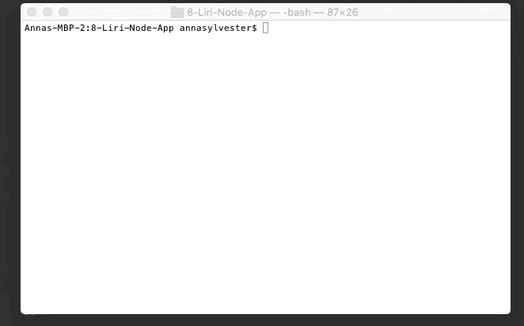
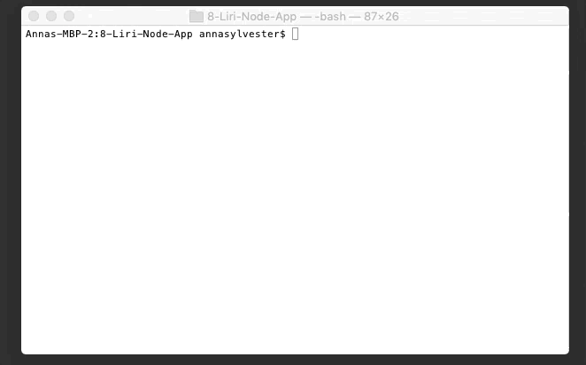
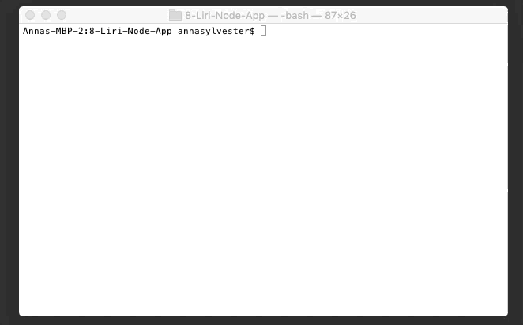

# 8-Liri-Node-App

## Commands

### Calling the Bands In Town API
```bash
node liri.js concert-this "Band Name"
```


If no band is specified, an error message is displayed.
```bash
node liri.js concert-this
```


### Calling the Spotify API
```bash
node liri.js spotify-this-song "Song Title"
```


If no song is specified, The Sign by Ace of Base is searched.
```bash
node liri.js spotify-this-song
```


### Calling the OMDB API
```bash
node liri.js movie-this "Movie Title"
```


If no movie is specified, Mr. Nobody is searched.
```bash
node liri.js movie-this
```


### Reading the txt file and searching what is inside
```bash
node liri.js do-what-it-says
```
