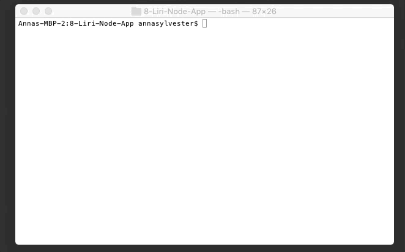

# 8-Liri-Node-App

## Assignment
* Create a Liri Node App that takes user input from the command line
* Integrate Bands In Town, Spotify and OMDB APIs
* Use API calls to return JSON objects and format
* Read commands from file

## Technologies Used
* Node.js
* JavaScript
* Bands In Town API (via axios nmp module)
* Spotify API (via spotify npm module)
* OMDB API (via axios nmp module)

## Code Explained
* Authentication keys for Spotify are stored in "keys.js" and we are exporting it into "liri.js"
* What this app does depends on what the user types. There are 4 functions:
    1. "concert-this" - Calls the Bands In Town API and displays the details of the next 3 concerts for the artist specified. If no artist is specified, an error message will occur.
    2. "spotify-this-song" - Calls the Spotify API and displays the details of the song specified. If no artist is specified, the default search is "The Sign" by Ace of Base.
    3. "movie-this" - Calls the OMDB API and displays the details of the movie specified. If no movie is specified, the default search is "Mr. Nobody".
    4. "do-what-it-says" - Reads the file, "random.txt", which contains the string "I Want It That Way" and calls the Spotify API to search for that song.

## Demo Time!

### Calling the Bands In Town API
```bash
node liri.js concert-this "Band Name"
```


If no band is specified, an error message is displayed.
```bash
node liri.js concert-this
```


### Calling the Spotify API
```bash
node liri.js spotify-this-song "Song Title"
```


If no song is specified, The Sign by Ace of Base is searched.
```bash
node liri.js spotify-this-song
```


### Calling the OMDB API
```bash
node liri.js movie-this "Movie Title"
```


If no movie is specified, Mr. Nobody is searched.
```bash
node liri.js movie-this
```


### Reading the txt file and searching what is inside
```bash
node liri.js do-what-it-says
```
